# Tether

A simple, structure-aware Google Drive sync engine for Obsidian, developed by **Llewellyn Paintsil**. Tether provides a seamless way to keep your entire vault—including settings, themes, and complex folder hierarchies—perfectly synced between your local device (Android/Desktop) and Google Drive using your own Google Cloud project so you control your data.

## 🌟 Key Features

### 📱 Full Android & Desktop Compatibility

Built specifically to bypass the limitations of mobile devices. Tether uses Obsidian's native `requestUrl` API to handle large network requests and file operations without triggering CORS errors or memory crashes on Android.

### 📁 Exhaustive Vault Structure Sync

- **Hidden Folders:** Syncs the `.obsidian` folder, ensuring your plugins, themes, hotkeys, and CSS snippets are identical across all devices.
- **Deep Nesting:** Supports vaults with complex sub-folder structures.
- **Vault Root Isolation:** Creates a dedicated folder named after your vault inside your chosen Google Drive directory.

### 🚀 Performance & Reliability

- **Resumable Uploads:** Uses Google's resumable upload protocol to handle files of any size with zero file size limits.
- **Auto-Pagination:** Correctly handles large vaults by automatically paginating through Google Drive API results.
- **Background Sync:** Automatically checks for updates on startup and at configurable intervals.

### 🛡️ Data Safety & Conflict Resolution

- **Keep Both Strategy:** If a file is edited on two devices simultaneously, Tether creates a `(conflict - timestamp)` copy. It **never** overwrites your local data during a conflict.
- **Mirror Deletions:** If you delete a file locally, it is automatically removed from Google Drive on the next sync.
- **Conflict Management:** View and open conflicted files directly from the sync sidebar to resolve them manually.

---

## 🛠️ Installation

1.  **Locate Plugin Folder:** Open your vault folder and navigate to `.obsidian/plugins/`.
2.  **Create Directory:** Create a folder named `tether-google-drive-sync`.
3.  **Transfer Files:** Copy the following 3 files from this project into that new folder:
    - `main.js`
    - `manifest.json`
    - `styles.css`
4.  **Enable Plugin:** Open Obsidian, go to `Settings > Community Plugins`, click the Refresh icon, and toggle **Tether** to ON.

---

## 🚀 Step-by-Step Setup Guide

Tether includes a **Setup Wizard** in the settings tab to guide you through these steps:

### Step 1: Create Google Cloud Credentials (Google Cloud Console)

1.  Go to [Google Cloud Console](https://console.cloud.google.com/)
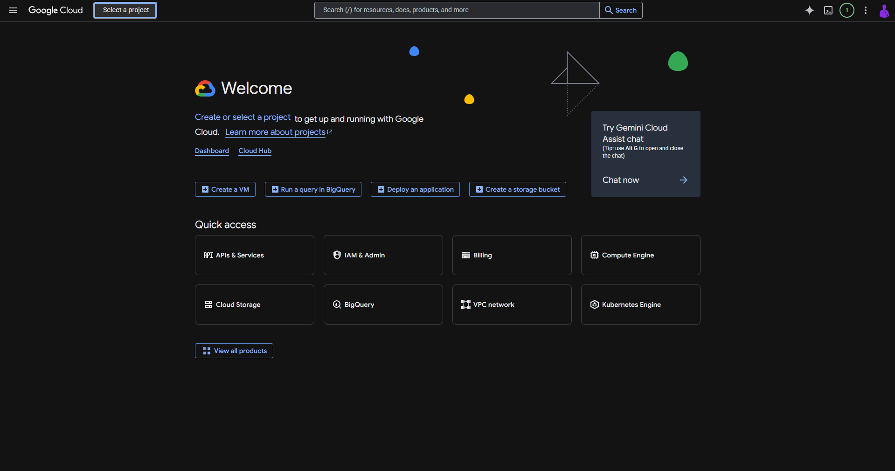
    <!--  -->

2.  Click **"Select a project"**

 <!--  -->

3.  Click **"New project"**
    

4.  In the project name field, type **"Tether-Sync"**
    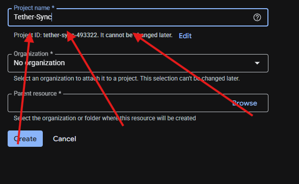

5.  Click **"Create"** button.
    

6.  Click **"APIs & Services"**
    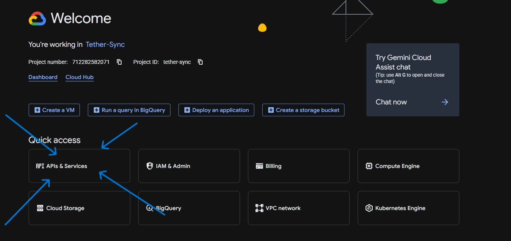

7.  Click **"Library"**
    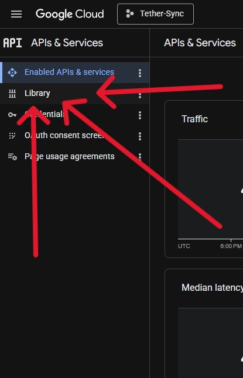

8.  Click the **"Search for APIs & Services"** field.
    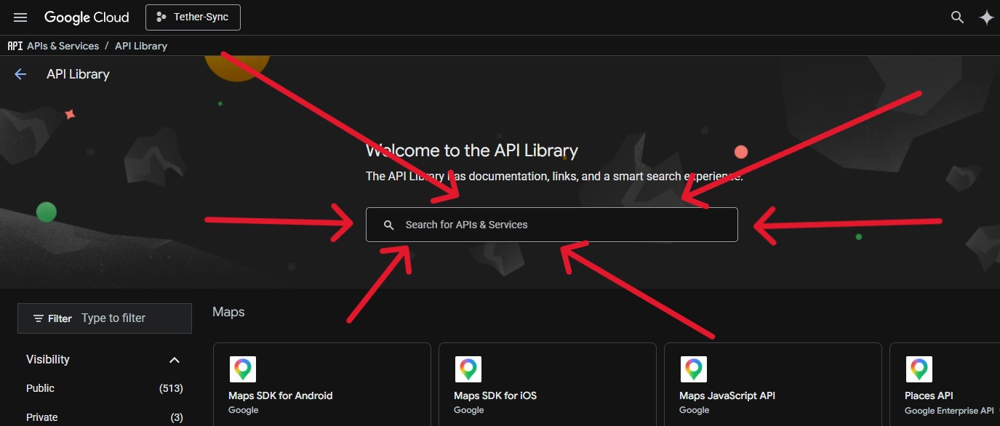

9. Type **"Google drive"**
    

10. Click **"google drive api"**
    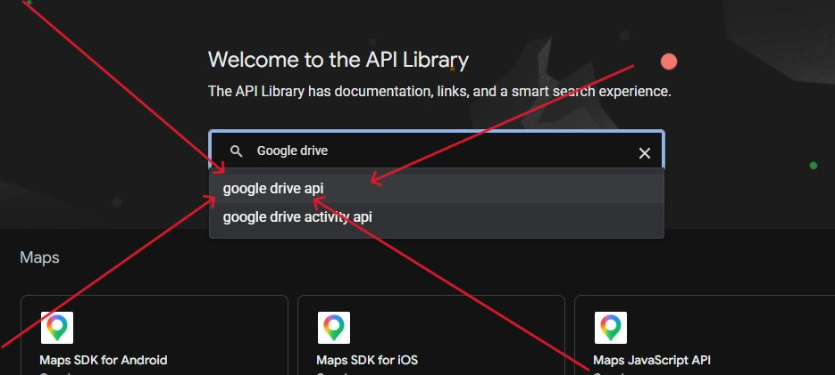

11. Click **"Google Drive API"**
    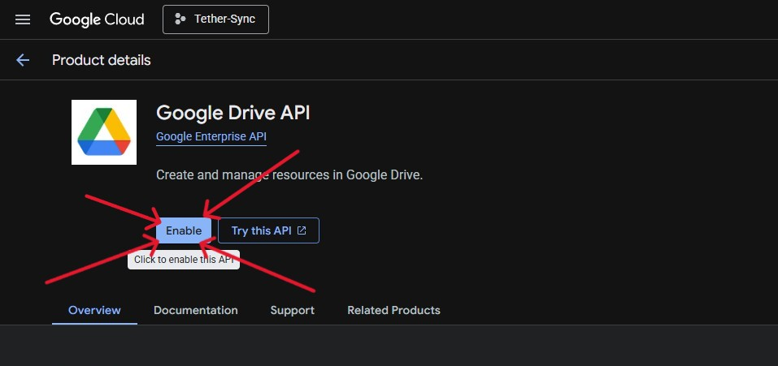
13. Click **"Enable"**
    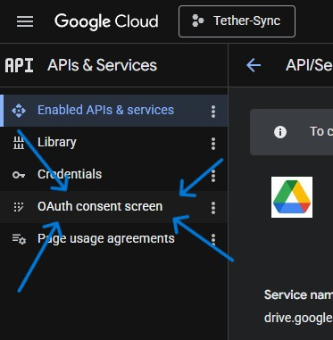
14. Click **"OAuth consent screen"**
    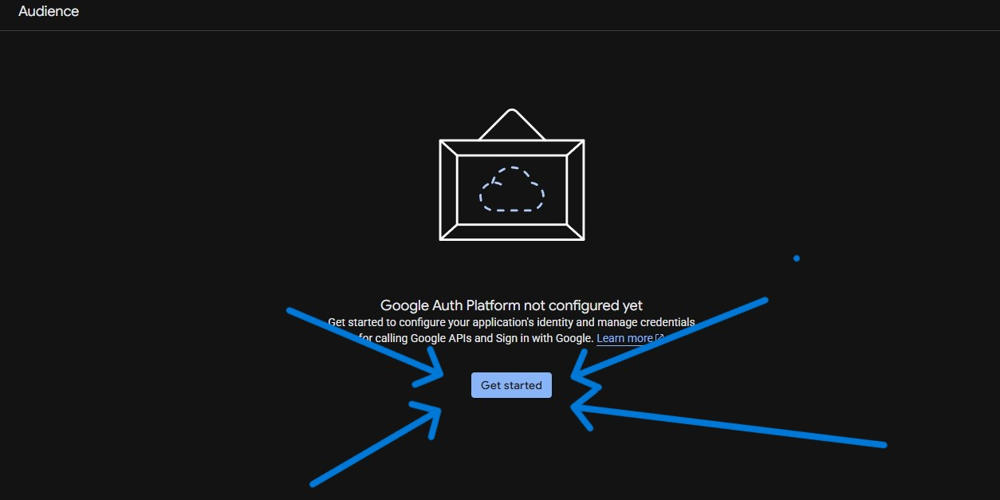
15. Click **"Get started"**
    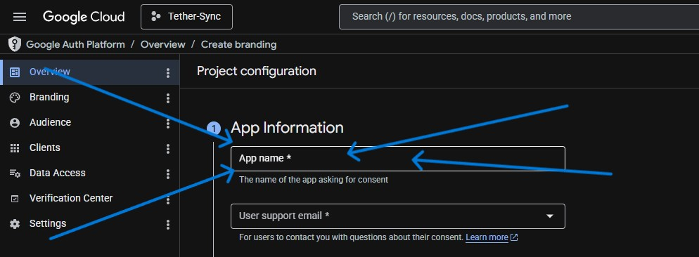
16. Click the **"App name"** field.
    
17. Type **"Tether-Sync"**
    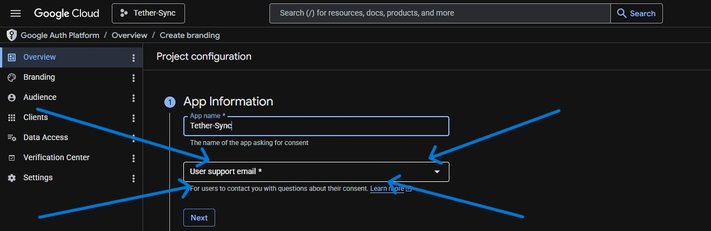
18. Click **User Support email**.
    
19. Click **"your-email@gmail.com"**
    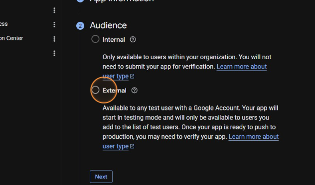
20. Click **"Next"**
    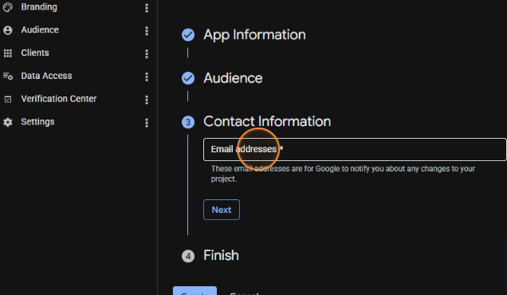
21. Click **"External"**
    
22. Click **"Next"**
    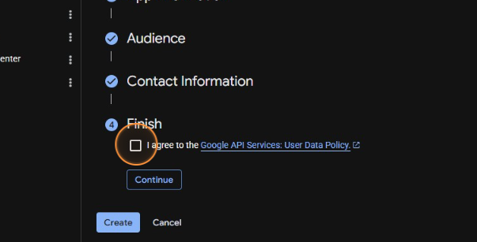
23. Click **"Email addresses"** (Developer contact info)
    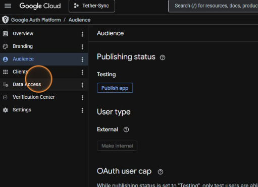
24. Click **"Next"**
    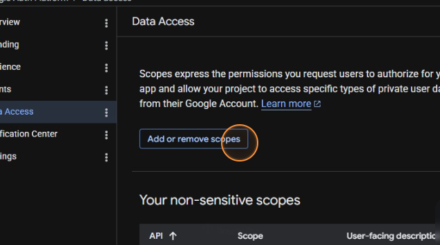
25. Click the **"I agree to the Google API Services: User Data Policy."** field.
    
26. Click **"Continue"**
    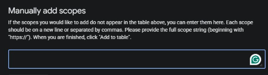
27. Click **"Create"**
    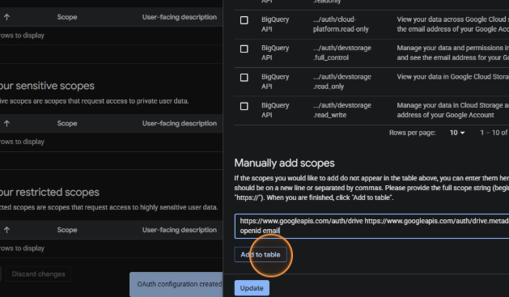
28. Click **"Data Access"**
    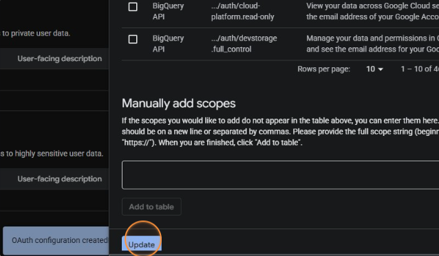
29. Click **"Add or remove scopes"**
    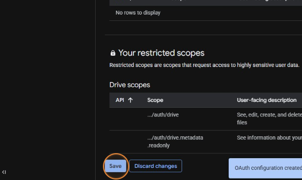
30. Click the scope string: `https://www.googleapis.com/auth/drive https://www.googleapis.com/auth/drive.metadata.readonly openid email`
    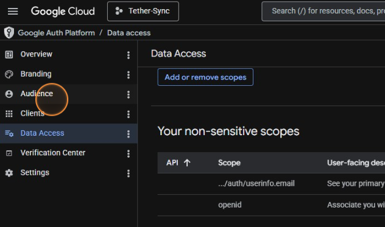
31. Press **Ctrl + C** to copy it.
    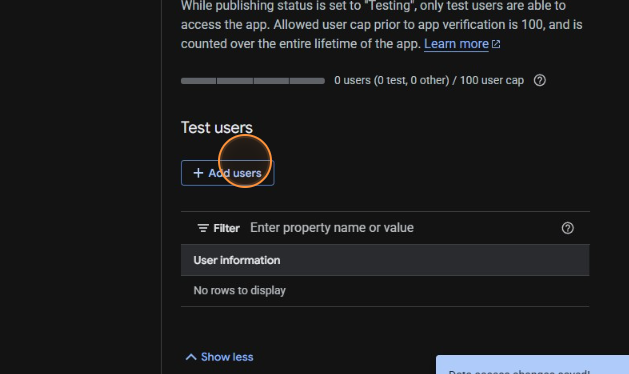
32. Click the **"Manually add scopes"** field.
    
33. Press **Ctrl + V** to paste the string.
    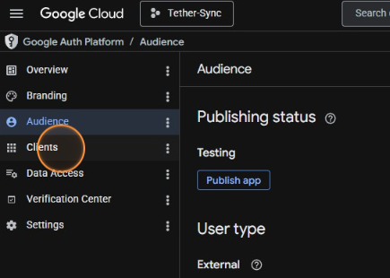
34. Click **"Add to table"**
    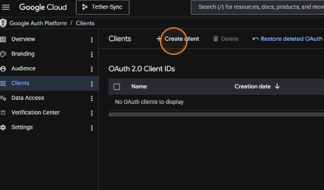
35. Click **"Update"**
    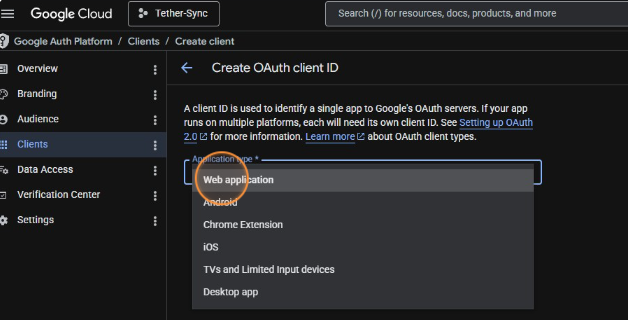
36. Click **"Save"**
    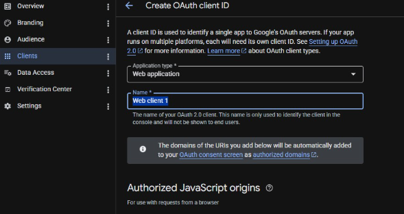
37. Click **"Audience"**
    
38. Click **"Add users"**
    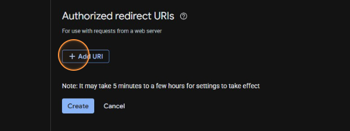
39. Click the field to add your email.
    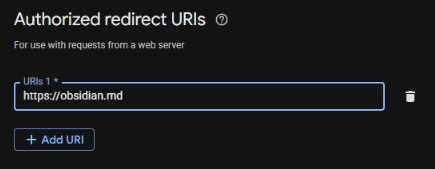
40. Click **"Save"**
    
41. Click **"Clients"**
    
42. Click **"Create client"**
    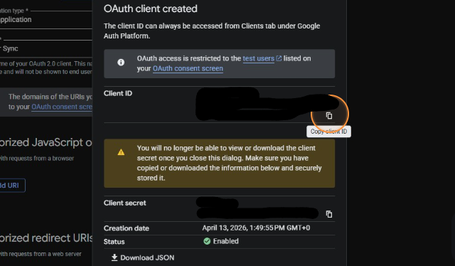
43. Click the **"Application type"** dropdown.
    
44. Click **"Web application"**
    
45. Click the **"Name"** field.
    
46. Press **Ctrl + A** to select all.
    
47. Type **"Tether Sync"**
    
48. Click the redirect URI: `https://obsidian.md`
    
49. Press **Ctrl + C** to copy it.
    
50. Switch back to the **"Create OAuth client ID"** tab.
    
51. Click the **"Add URI"** icon.
    
52. Click the **"URIs 1"** field.
    
53. Press **Ctrl + V** to paste the URI.
    
54. Click **"Create"**
    
55. Click the **"Copy Client ID"** icon.
    
56. Click the **"Copy Client Secret"** icon.
    
57. Click **"OK"** and paste these keys into Tether's settings.
    

### Step 2: Authentication

1.  In Obsidian settings for Tether, click **"Open Login Page"**.
2.  Log in with your Google account.
3.  You will be redirected to `obsidian.md`. **Copy the entire URL** from your browser bar.
4.  Paste that URL into the **"Authorization Code"** box in Obsidian and click **Verify Code**.

### Step 3: Choose Folder

1.  Click **"Select Drive Folder"**.
2.  Browse your Google Drive hierarchy.
3.  Either select an existing folder or create a new one.
4.  Click **"Select This Folder"** to begin syncing.

---

## 🔗 Author

**Llewellyn Paintsil**

- GitHub: [@Llewellyn500](https://github.com/Llewellyn500)
- Project Repo: [Tether](https://github.com/Llewellyn500/tether)

## 📄 License

This project is licensed under the MIT License.
